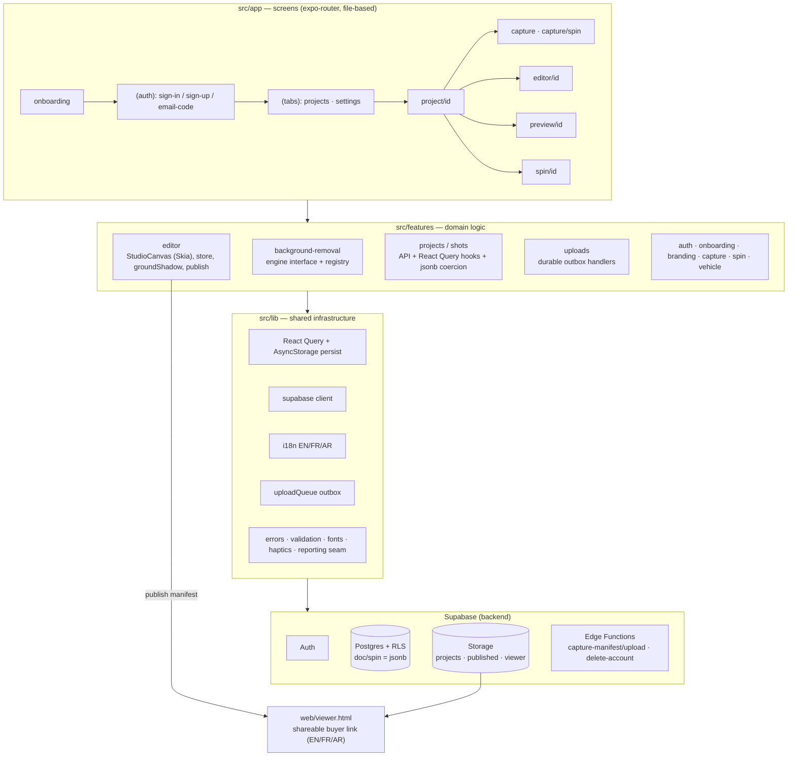

# CarStudio — Architecture (the "conception")

What we're building and how it's put together. This is the *system* design (layers,
data flow, state, boundaries), not the visual design (that's `src/theme.ts`).

## In one sentence

A **native, offline-first mobile app** that turns a phone into a car-photo studio:
capture guided shots → remove the background **on-device** → composite onto a studio
scene with hotspots → **publish an interactive web link** a buyer opens in any browser.
Backend is **Supabase** (auth, Postgres, Storage), protected by Row-Level Security.

## Layers

The code is organized in one direction of dependency: **screens → features → shared lib →
backend**. Nothing lower imports from a layer above it.



## State — three kinds, kept separate

| Kind | Tool | Examples |
|---|---|---|
| **Server state** | React Query (+ AsyncStorage persist) | projects, shots, signed URLs — cached → instant loads, offline reads |
| **Editor state** | Zustand (`editorStore`, undo/redo) | current cutout, background, hotspots, plate, zoom |
| **Session** | `AuthProvider` (Supabase) | the auth session/user |
| **Device prefs & flags** | AsyncStorage | locale, seller brand, capture prefs, onboarding-seen |
| **Pending work** | durable outbox (`uploadQueue`) | captured photos waiting to upload (survives app kill) |

Keeping these separate is what makes the app feel instant and work offline.

## Key data flow — capture to buyer

1. **Capture** (guided camera) copies each photo to a durable **outbox** and returns immediately — works with no network.
2. On reconnect the outbox **drains**: upload the file to Storage, then write the `shots` row (only after the file lands).
3. **Editor** loads a signed URL and `StudioCanvas` (Skia) composites background + alpha-derived ground shadow + cutout + hotspots + plate mask + watermark.
4. **Publish** (`publish.ts`) builds a JSON manifest (signed URLs + layout + hotspots) and uploads it to the public `viewer` bucket.
5. The buyer opens `web/viewer.html?d=<manifest>` — an interactive 360 + gallery + condition report, localized EN/FR/AR. No app install.

## SOLID — applied to a *functional* codebase (not classes)

React Native is component/hook-based. Forcing OOP classes here would fight the framework and
break **KISS/YAGNI** — so SOLID is honored the functional way:

- **S — Single responsibility:** each feature folder, hook, and *pure module* does one thing —
  `groundShadow.ts` (math), `oauth.ts` (parse), `errors.ts`, `vin.ts`, `publish.ts` (orchestrate).
- **O — Open/closed:** add a background-removal engine or a background preset without touching
  callers — see the registry below.
- **L — Liskov:** any `BgRemovalEngine` is interchangeable behind the interface.
- **I — Interface segregation:** components take only the props they use; hooks stay small
  (`useShots`, `useSignedUrl`, `useDebouncedAutosave`) instead of one god-hook.
- **D — Dependency inversion:** screens depend on **hooks/interfaces**, not concrete
  implementations. The clearest example:

```
features/background-removal/
  types.ts       # BgRemovalEngine interface  <- consumers depend on THIS
  registry.ts    # picks the active engine
  engines/
    sixthreeEngine.ts   # ML Kit / Vision (on-device)
    executorchEngine.ts # alternative, uninstalled
```

The editor calls `useBackgroundRemoval()` → the registry's engine. Swapping to a cloud engine
later touches **one file**, not the screens. Same idea for the reporting seam (`setReporter`)
and the Supabase client hidden behind the `*.api.ts` modules.

**KISS / YAGNI in practice:** no classes, no premature abstractions, no responsive-scaling or
state-management libraries we don't need. Dead code is removed when found (that's the one
exception we actively hunt).

## Responsivity — how it looks on any phone

React Native lays out in **density-independent points** with **flexbox**, so an iPhone 12 Pro
(~390pt) and a Galaxy S25 Ultra (~480pt) both get correct proportions automatically — the wider
screen simply gets more room, not broken layout. On top of that:

- **Flex + percentage widths** (e.g. project cards at `48.5%`) — columns adapt to width.
- **`maxWidth` caps** on text/content — never stretches ugly on the widest screens.
- **`useWindowDimensions`** where a screen needs the live width (onboarding pager).
- **`react-native-safe-area-context`** — notches, punch-holes, home indicators handled.
- **Portrait-locked** — no landscape edge cases to maintain.
- **No `Dimensions.get()`** frozen at import (which would break on rotation/split-screen).

We deliberately do **not** add a scaling library (YAGNI). The one thing only a device can
confirm is fine-tuning on a very small budget Android screen and the Arabic RTL mirror — that's
on the Day-1 device checklist.

## Security

- **Row-Level Security** on every table — a user only ever sees their own rows.
- The app ships the **publishable (anon) key** only; RLS is the guard. The `service_role` key is
  never in the client.
- Storage buckets: `projects` (private, per-user), `published`/`viewer` (public JSON + assets
  for shareable links only).

## CI / CD

- **CI — `.github/workflows/ci.yml`** runs on **every push and PR**: `typecheck` → `lint` →
  `test` (+ `expo-doctor`, informational). A broken build never reaches `main`. See the repo's
  **Actions** tab.
- **CD — `.github/workflows/eas-build.yml`** builds the app in the cloud (EAS). It's manual and
  needs an `EXPO_TOKEN` repo secret to run. Store distribution (AAB + `eas submit`) is Phase 2.

## Testing

`jest` + `jest-expo`, **152 tests**. Strategy: unit-test **pure modules** (shadow math, VIN,
OAuth parse, error mapping, publish manifest) and mock the I/O boundary (Supabase/native) rather
than chase UI snapshots. Fast, deterministic, and it runs in CI.

## Where to look

| You want to… | Go to |
|---|---|
| Add/adjust a screen | `src/app/…` |
| Change domain logic | `src/features/<domain>/` |
| Change look & tokens | `src/theme.ts` + `src/components/` |
| Swap the cutout engine | `src/features/background-removal/registry.ts` |
| Change the buyer page | `web/viewer.html` |
| Change the DB/Storage | `supabase/_setup_all.sql` |
